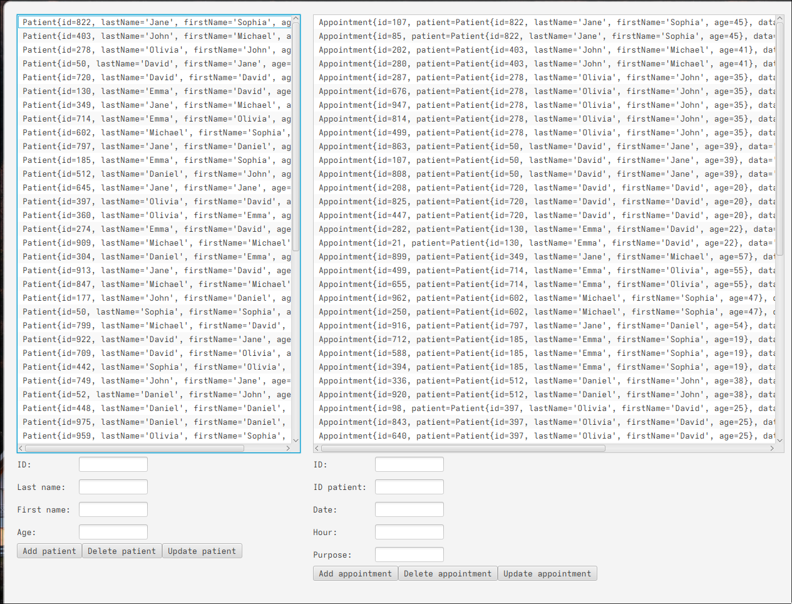
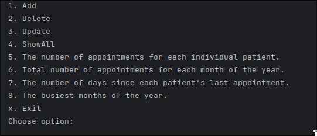

# 🩺 Doctor’s Office Scheduler — JavaFX Application with SQL Repository

## 💡 About the App

This application is a **scheduler for a doctor’s office**, designed to efficiently manage patients and their appointments.  
It allows adding, updating, deleting, and viewing appointments, while also providing detailed reports about scheduling trends and activity over time.

The main purpose of this app is to demonstrate an understanding of:
- **OOP principles and layered architecture (UI → Service → Repository → Domain)**
- **Connecting JavaFX with SQL databases**
- **Data persistence, reporting, and stream processing in Java** 
- **Switching between repository types (in-memory, file-based, SQL, NoSQL)** via a configuration file   
- **Launching the app either via Command Line or GUI**, based on the settings file

---

## ✨ Key Features

✅ **SQL Repository Integration** – Entities are now persisted in an SQL database with 100 pseudo-randomly generated entries.  
✅ **Configurable Settings** – The app dynamically switches between repository types using the `settings.properties` file.  
✅ **JavaFX GUI** – A graphical interface complements the existing CLI version for better user interaction.  
✅ **Java Streams Reports** – Efficient data processing and reporting using Java 8 streams.  
✅ **Extendable Architecture** – Easily adaptable for NoSQL integration and future scalability.
