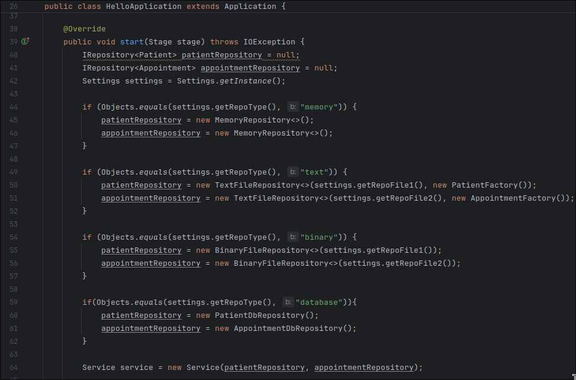

# 🩺 Doctor’s Office Scheduler — JavaFX Application with SQL Repository

## 💡 About the App

This application is a **scheduler for a doctor’s office**, designed to efficiently manage patients and their appointments.  
It allows adding, updating, deleting, and viewing appointments, while also providing detailed reports about scheduling trends and activity over time.

---

## ✨ Key Features

✅ **JavaFX GUI** – A graphical interface complements the existing CLI version for better user interaction.  
  
✅ **Console UI** - A CLI interface for extended reports.  
  
✅ **Configurable Settings** – The app dynamically switches between repository types using the [`settings.properties`](settings.properties) file.  
  
✅ **Java Streams Reports** – Efficient data processing and reporting using Java 8 streams. Check [Service.java](src/main/java/Service/Service.java).  
✅ **SQL Repository Integration** – Entities are now persisted in an SQL database with 100 pseudo-randomly generated entries. Check [PatientDbRepository.java](src/main/java/Repository/PatientDbRepository.java) and [AppointmentDbRepository.java](src/main/java/Repository/AppointmentDbRepository.java).  
✅ **Extendable Architecture** – Easily adaptable for NoSQL integration and future scalability.  

## Main purpose
The main purpose of this app is to demonstrate an understanding of:
- **OOP principles and layered architecture (UI → Service → Repository → Domain)**
- **Connecting JavaFX with SQL databases**
- **Data persistence, reporting, and stream processing in Java** 
- **Switching between repository types (in-memory, file-based, SQL, NoSQL)** via a configuration file   
- **Launching the app either via Command Line or GUI**, based on the settings file

